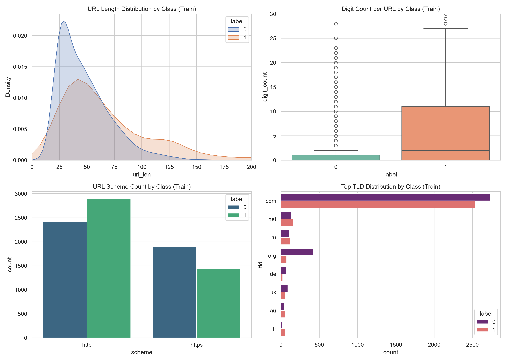
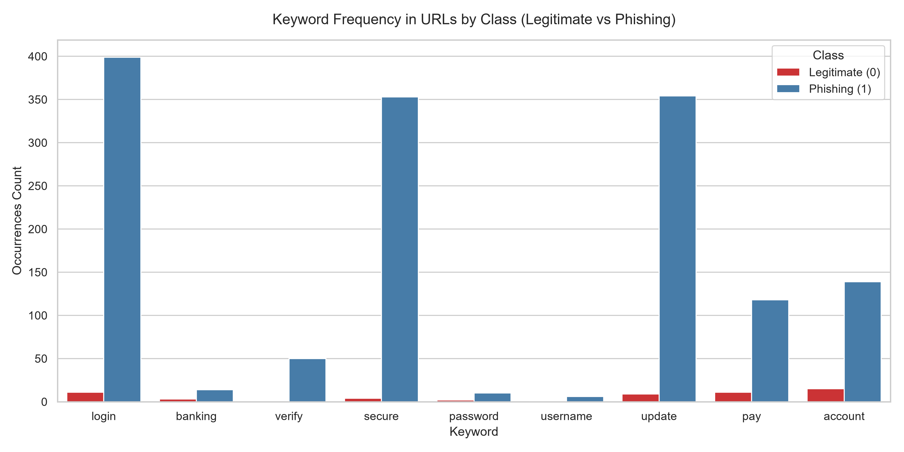

# Phishing URL detection

## Exploratory data analysis (EDA)

In the first step I had to analyze the training data. I wrote the eda.py for a thorough analysis. There are 8651 rows and no missing values for either the URL or the label. The class distribution is balanced, roughly around 50-50% of clean and phishing URLs.

From my research online I found out that phishing URLs usually have unique characteristics compared to clean ones. The length of the URL is often larger and there are more dots, hyphens, digits and special characters in them. I inspected those properties for the training data and found that the length of the URL, the digit and special character count are strong indicators of the class. Therefore later in the model building they can be used as features.

I also analyzed the number of URL schemes per class. I found that phishing URLs are more likely to have http rather than https, but the difference is not that significant. I also inspected the TLD-s of the URLs, but did not find a strong characteristic difference in the distributions between the classes (except that .org is more frequently a safe page than not). The visualization of these analytics can be seen in Figure 1.

  
   
  
<i>Figure 1: Different characteristics of the URLs for both classes</i>

From online research and looking at the training data I found that another strong indicator of phishing URLs are specific keywords. These are the following: login, banking, verify, secure, password, username, update, pay, account. I analyzed the presence of these in the two classes, the results can be seen in Figure 2. I concluded that, out of these 9 keywords 6 showed strong correlation with the phishing class (login, verify, secure, update, pay, account). The presence of these keywords can be used later as features in model building.

  
   
  
<i>Figure 2: The frequency of the keywords in the two classes</i>

From the last step of the EDA I looked at the duplicates and the conflicting labels in the training data. It is clear that the data need to be cleaned.

## Data cleansing

According to the assignment the external_test.csv has been cleaned, but the train.csv has not. The external_test dataset has been cleaned by not only removing the hard duplicates and conflicting labels, but also comparing the URLs after normalisation. The normalisation is described in the assignment. I applied the same normalisation rule for the training data, removing the scheme, the leading www., the trailing slashes and converting to lowercase.

After normalization of the training data, 107 rows were removed due to conflicting labels for the same URL. 219 duplicate entries were also removed. After cleaning, 8325 rows remained from the original 8651 (96.2%). The remaining rows are also balanced in the labels. The new, cleaned dataset is saved as the train_cleaned.csv in the data folder.

## Training

On the cleaned dataset I trained two models for the classification task of URLs into clean and phishing classes. The baseline model is a Logistic Regression (LR). The numerical inputs of the model have been normalised for stability. The maximum number of iterations in training is 1000 and the random_seed is set for reproducibility. The LR model gets the following URL specific features as inputs:

- Length of the URL
- Total number of digits in the URL
- Total count of special characters in the URL
- Flags for keyword presence (keywords: login, verify, secure, update, pay, account)

The improved model gets the URL specific inputs of the baseline model too. I gained additional textual features from the training data with Term Frequency-Inverse Document Frequency (TF-IDF) feature extractor. It converts textual inputs into a matrix that represents the frequency of tokens (words or n-grams) in the URL compared to the frequency in the whole database. I applied TF-IDF to the training data, extracting 10000 features. They are n-grams ranging from the length of 3 to 5.

These, combined with the original URL specific features, gives the feature space. The improved model is a LightGBM Classifier, that uses a gradient boosting technique to train sequential decision trees. In my model there are a total number of 300 sequential decision tree estimators. The random_seed has been set for reproducibility.

Both the baseline and the improved model have been validated with 5-fold cross validation and than retrained on the whole training dataset. The evaluation of the final models are based on these metrics: Recall, False Positive Rate (FPR), Precision, F1 score and ROC-AUC. The results can be seen in Table 1. We can see that the baseline model could not fit well on the training dataset. The precision is higher, but the recall is quite low. The improved model produced much better validation results. This is due to the model being more complex and the extension of the feature space with textual tokens.

| Metric | Baseline (LR) | Improved (LightGBM) |
| :--- | :--- | :--- |
| Recall | 0.4555 | 0.9194 |
| FPR | 0.0801 | 0.0608 |
| Precision | 0.8459 | 0.9353 |
| F1 | 0.5916 | 0.9273 |
| ROC-AUC | 0.7408 | 0.9780 |

*Table 1: Results of the 5-fold cross validation*

The final models are saved in the models folder for later use.

## Evaluation

The final models, both the baseline and the improved can be evaluated on the two provided test sets. The confidence threshold for the evaluation is 0.5 in all cases. On the test.csv dataset the results are the following:

| Metric | Baseline (LR + Domain) | Improved (LightGBM + Hybrid) |
| :--- | :--- | :--- |
| Recall | 0.4423 | 0.9342 |
| FPR | 0.0665 | 0.0700 |
| Precision | 0.8693 | 0.9303 |
| F1 | 0.5863 | 0.9323 |
| ROC-AUC | 0.7364 | 0.9819 |

*Table 2: Results on the test dataset*

We can see that the improved model generalized well on the training data and therefore produce good results on the test set as well.

The same evaluation can be done on the external_test.csv. These URLs are coming from another source, so we can assume that their distribution and the properties of them will differ from the training data. We can clearly see the result of that difference in the evaluation metrics:

| Metric | Baseline (LR + Domain) | Improved (LightGBM + Hybrid) |
| :--- | :--- | :--- |
| Recall | 0.2351 | 0.5647 |
| FPR | 0.0021 | 0.0042 |
| Precision | 0.9912 | 0.9926 |
| F1 | 0.3801 | 0.7199 |
| ROC-AUC | 0.6820 | 0.8931 |

*Table 3: Results on the external test dataset*

The precision remained high, meaning that the found phishing URLs are true and the false positive rate is low. Our model will not produce a lot of false alarms on the external source. However, the recall is quite low even with the improved model. The external source might have different variations of phishing URLs that the models have not seen during training. The false negative rate will be high, therefore lots of phishing URLs will not be caught. To improve the model it would be nice to get more data from this external source and train on them too.

The difference between the evaluation results of the two test sets is caused by the similarity of URLs. In the test.csv the properties of the URLs are similar to the train.csv. This can be measured with the overlap between the two datasets. I defined the overlap on three different levels:

- The exact URL overlap means that after normalization the URL in the test set is present in the training data as well. This data leakage can boost the model's apparent performance.
- The host overlap means that the domain name of the URL in the test set is also present in the training data. A model could learn the domain name of the secure websites and classify them easily.
- The registered domain overlap means that the primary domain name and the TLD of the URL in the test set is also present in the training data.

The overlaps between the train and test dataset, and the train and the external_test dataset can be seen in the following table:

| Analysis Category | Test | External Test |
| :--- | :--- | :--- |
| Exact URL Overlap | 146 / 2858 (5.11%) | 0 / 2858 (0.00%) |
| Host Overlap | 963 / 2858 (33.69%) | 24 / 2858 (0.84%) |
| Registered Domain Match | 1500 / 2858 (52.48%) | 453 / 2858 (15.85%) |

*Table 4: The overlap of the test datasets with train dataset*

With the test set the overlap is quite large, indicating that their source is indeed the same. The overlap between the train and the external_test is very low. Only the registered domain overlap is significant. This verifies the fact that the source, the distribution and properties of this test set are different and therefore the models cannot generalize well on these URLs.

## Inference

The inference.py can be used to predict the label of a single URL. Both the baseline and the improved model can be used. The core of the prediction is built in predict.py, so it can be implemented in any other software as well. The output of the prediction is the label "clean" or "phishing" and the probability of the prediction by the model.

## Next steps

The improved model works well on the test dataset. However further improvement could be done. The results on the external_test dataset show that the phishing URLs that differ from the ones in the training set are hard to detect with my model. It would be advised to integrate URLs from other sources into the training dataset, to make it more diverse. The hyperparameters of the models are arbitrary, the results could be improved with a thorough grid search on them. Also other features of the URLs could be considered as inputs to the models. A search for new keywords would be desired.

## Usage

Important information:
- The data is not included in the repository, feel free to put train.csv, test.csv and external_test.csv into the data folder.
- To run train.py you have to first run data_cleansing.py first to create train_cleaned.csv.

Folders:
- data: the folder of csv data
- models: the saved trained models (baseline and improved)
- plots: plots from the EDA
- predictions: the prediction on the test and external_test data
- scripts: python scripts from eda until inference
- venv: virtual environment to run the python scripts. To activate, type into the terminal: venv\Scripts\activate
- requirements.txt: the required python libraries with version

Scripts to run in order:
- eda.py
- data_cleansing.py
- train.py
- evaluate.py
- inference.py

You can run all the scripts in this order. To only try out single URL prediction run inference.py.
